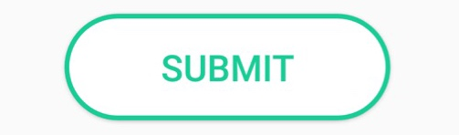
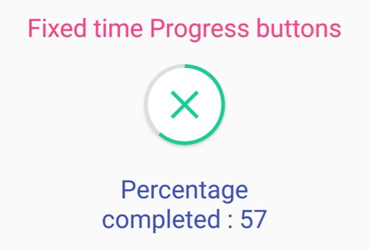
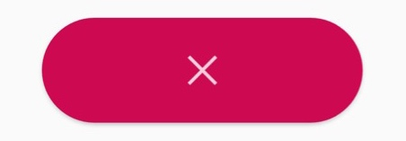
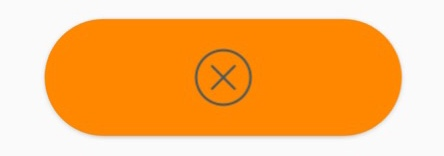

 

# User Guide

## Version 1.0.0

## Integration

The lib is available on jcenter, you can find it with 

```
dependencies {
    compile 'com.nihaskalam.android:progress-button:1.0.0'
}
```

## Usage

Declare button inside your layout XML file:

``` 
<com.nihaskalam.progressbuttonlibrary.CircularProgressButton
            android:id="@+id/circularButton3"
            android:layout_width="196dp"
            android:layout_height="64dp"
            android:layout_marginTop="16dp"
            android:onClick="onClickThirdBtn"
            android:textColor="@color/text_state_selector"
            android:textSize="22sp"
            app:pb_colorIndicator="@color/colorButtonCompleteState"
            app:pb_cornerRadius="48dp"
            app:pb_iconCancel="@drawable/ic_action_cross"
            app:pb_iconComplete="@drawable/ic_action_accept"
            app:pb_iconError="@drawable/ic_action_cancel"
            app:pb_selectorCancel="@color/pb_cancel_state_selector"
            app:pb_selectorComplete="@color/complete_state_selector"
            app:pb_selectorError="@color/error_state_selector"
            app:pb_selectorIdle="@color/idle_state_selector"
            app:pb_textColorAfterClick="@color/colorWhite"
            app:pb_textIdle="@string/submit" />
```

Different button states are:
- normal state [0]
- progress state [1-99]
- success state [100]
- error state [-1]
- cancel state [-2]

You can show different button states using the following methods:
- showProgress() 
- showIdle() 
- showComplete() 
- showError()
- showCancel()

You can check different button states using the following methods:
- isProgress() 
- isIdle() 
- isErrorOrCompleteOrCancelled() 

Or comparing value of `getProgress()` against different button state values mentioned above(0, -1, -2, 100, 1-99).

## Idle state

`CircularProgressButton.showIdle()`

- To change text `app:pb_textIdle="@string/Upload"`
- To change background color create color state selector and point to it with `app:pb_selectorIdle="@drawable/idle_state_selector" attribute.
```
<?xml version="1.0" encoding="utf-8"?>
<selector xmlns:android="http://schemas.android.com/apk/res/android">
    <item android:color="@color/colorButtonCompleteState" android:state_pressed="true" />
    <item android:color="@color/colorButtonCompleteState" android:state_focused="true" />
    <item android:color="@color/colorWhite" android:state_enabled="false" />
    <item android:color="@color/colorWhite" android:state_enabled="true"/>
</selector>
```


## Progress state

Button will be morphed to a circular progressbar

`CircularProgressButton.showProgress()`

### To turn on Indeterminate Progress

`CircularProgressButton.setIndeterminateProgressMode(true)`

### Set custom time to Progressbar

```
CircularProgressButton.setIndeterminateProgressMode(false)
CircularProgressButton.setSweepDuration(time)

```
You can set listener to get the time update for the fixed time progressbar
```
CircularProgressButton.setOnAnimationUpdateTimeListener(new OnAnimationUpdateTimeListener() {
            @Override
            public void onAnimationTimeUpdate(int timeElapsed) {
                //Do something
            }
        });
```



### To set manual progress - 

```
CircularProgressButton.setIndeterminateProgressMode(false)
CircularProgressButton.setCustomProgressMode(true)
CircularProgressButton.setCustomProgress(progressAmount);
```


Progress amount can be any value between 0-100. For instance, 0 for empty state, 50 for half filled, 100 for fully filled progress and so on.

- To change indicator color `app:pb_colorIndicator="@color/pb_blue"`
- To change indicator background color `app:pb_colorIndicatorBackground="@color/pb_grey"`
- To change circle background color `app:pb_colorProgress="@color/pb_white"`
- To change cancel cross icon color `app:pb_colorCancel=""="@color/textColor"`

## Complete state

`CircularProgressButton.showComplete()`

- To change text `app:pb_textComplete="@string/Complete"`
- To change background color create color state selector and point to it with `app:pb_selectorComplete="@drawable/complete_state_selector"` attribute.
```
<?xml version="1.0" encoding="utf-8"?>
<selector xmlns:android="http://schemas.android.com/apk/res/android">
    <item android:color="@color/colorButtonCompleteState" android:state_pressed="true" />
    <item android:color="@color/colorButtonCompleteState" android:state_focused="true" />
    <item android:color="@color/colorButtonCompleteState" android:state_enabled="false" />
    <item android:color="@color/colorButtonCompleteState" android:state_enabled="true"/>
</selector>
```


## Error state

`CircularProgressButton.showError()`

To change text `app:pb_textError="@string/Error"`
To change background color create color state selector and point to it with `app:pb_selectorError="@drawable/error_state_selector"` attribute.
```
<?xml version="1.0" encoding="utf-8"?>
<selector xmlns:android="http://schemas.android.com/apk/res/android">
    <item android:color="@color/colorRed" android:state_pressed="true" />
    <item android:color="@color/colorRed" android:state_focused="true" />
    <item android:color="@color/colorRed" android:state_enabled="false" />
    <item android:color="@color/colorRed" android:state_enabled="true"/>
</selector>
```


## Cancel state

`CircularProgressButton.showCancel()`

To change text `app:pb_textCancel=""="@string/cancel"`
To change background color create color state selector and point to it with `app:pb_selectorCancel="@color/pb_cancel_state_selector"` attribute.
```
<?xml version="1.0" encoding="utf-8"?>
<selector xmlns:android="http://schemas.android.com/apk/res/android">
    <item android:color="@color/pb_orange" android:state_pressed="true" />
    <item android:color="@color/pb_orange" android:state_focused="true" />
    <item android:color="@color/pb_orange" android:state_enabled="false" />
    <item android:color="@color/pb_orange" android:state_enabled="true" />
</selector>
```


### You can set rounded corners

`app:pb_cornerRadius="48dp"`

### You can use icons for complete, error & cancel states

```
app:pb_iconComplete="@drawable/ic_action_accept"
app:pb_iconError="@drawable/ic_action_cancel"
app:pb_iconCancel="@drawable/ic_action_cross"
```

### You can set Button stroke color  by,

`CircularProgressButton.setStrokeColor(ContextCompat.getColor(this, R.color.colorStroke))`

### You can set background color of button after clicking the idle state button. 

You can use the same color of stroke of button for better looking and animations.

`app:pb_backgroundColorAfterClick=="@color/backgroundColor"`

### You can set text color of button after clicking the idle state button

`app:pb_textColorAfterClick="@color/textColor"`
